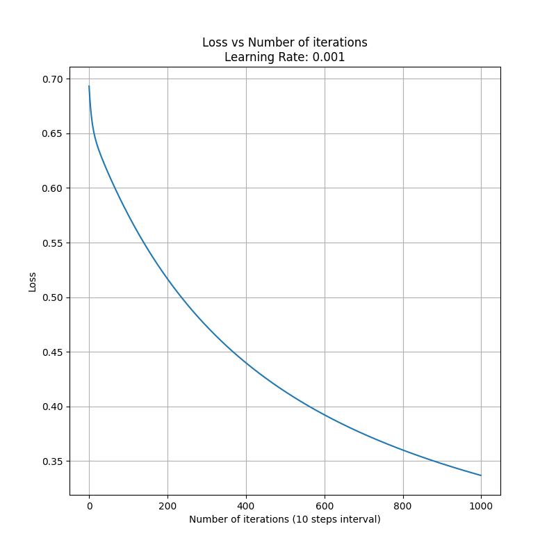
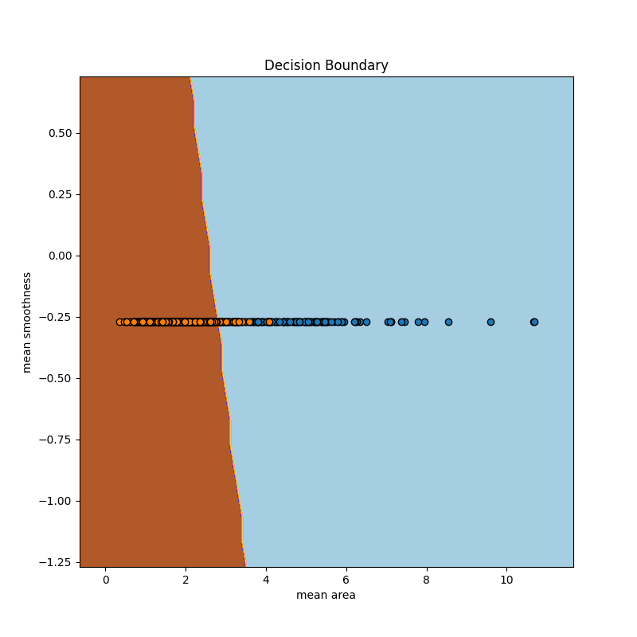

# ES654: Machine Learning | Assignment 03
## Question 01
---

### c) Overall Accuracy
The loss function decreases as represented in the below graph,

 

The test accuracy on the *breast cancer dataset* came out to be: **0.941798**

### d) Plotting Decision Boundary
The two features used were,
1. Mean Smoothness
1. Mean Area

The decision boundary comes out to be,

