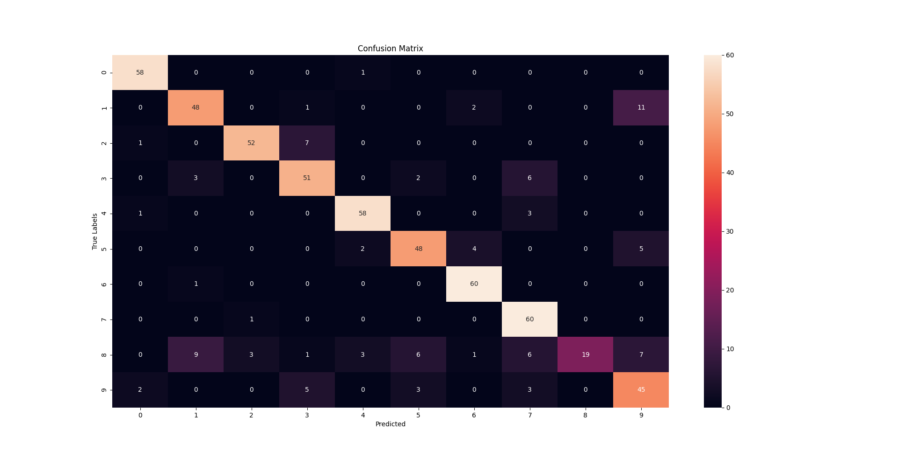

# ES654: Machine Learning | Assignment 03
### Pranshu Kumar Gond (18110124)
## Question 03
---

### c) Overall Accuracy and Confusion Matrix
The decrease in the loss function is presented in the given graph, 

The overall accuracy of the model came out to be: **0.83305**

The Confusion Matrix is given below,

Looking closely at the confusion matrix, 

The two digits that got the most confused were: digit **1** and **9**

The digits that were easily predicted are: **6** and **7**

### d) PCA Plot
After doing PCA on the given dataset, the dimensionality of the dataset was reduced to **2**. 

The PCA plot is given below, 

