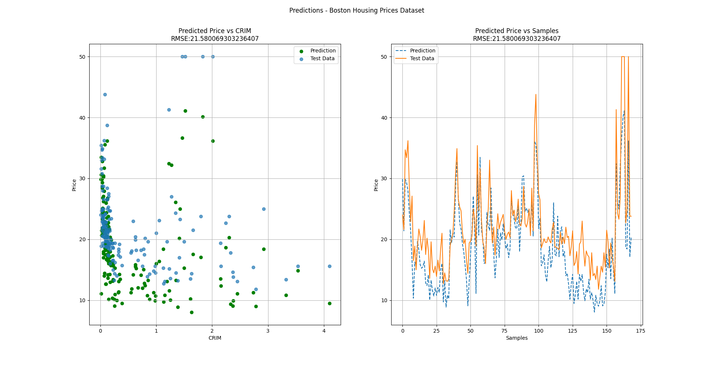

# ES654: Machine Learning | Assignment 03
### Pranshu Kumar Gond (18110124)
---
## Question 06

### Neural Network on Digits Dataset (Classification)
Train test dataset created using 3 Fold Cross Validation.
#### Model Parameters:
| Hyperparameters        | Value           | 
| ------------- |:-------------:| 
| Number of Input Nodes | 64      |
| Number of hidden layers      | 1 (20 Nodes) | 
| Number of Output Nodes      | 10     | 
| Activations for each layer | (Sigmoid, ReLU, Softmax) |
| Loss                       | Sparse Categorical Cross Entropy | 
| Learning Rate              | 0.001 |
| Number of iterations       | 5000 |

The decrease in the loss function is presented in the graph below,

Test accuracy: **0.92654**

### Neural Network on Boston Housing Prices Dataset (Regression)
Train test dataset created using 3 Fold Cross Validation.
#### Model Parameters:
| Hyperparameters        | Value           | 
| ------------- |:-------------:| 
| Number of Input Nodes | 13      |
| Number of hidden layers      | 1 (5 Nodes) | 
| Number of Output Nodes      | 1      | 
| Activations for each layer | (Sigmoid, ReLU, Linear) |
| Loss                       | MSE   |
| Learning Rate              | 0.001 |
| Number of iterations       | 5000 |

The decrease in the loss function is presented in the graph below,

RMSE: **77.2540**

#### Predictions
Two plots plotted to show results, they are:
1. Price vs Feature (CRIM), for both actual and predicted prices
2. Predicted Price of each sample vs Actual Price of each sample

