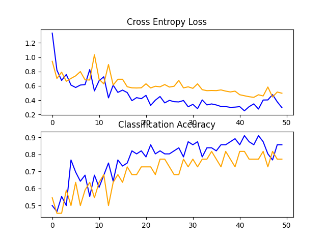
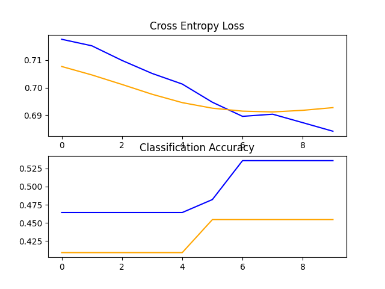

# ES654: Machine Learning | Assignment 03
### Pranshu Kumar Gond (18110124)
---
## Question 07

I used bears vs panther dataset. Downloaded the images and arranged them in the `images/` folder. (Details in the `q7_dataset.py` file)

Given below are the performance comparision between Transfer Learning VGG1 and Data Augmentation VGG1.

### Data Augmentation VGG1
Accuracy - **77.273**

### Transfer Learning VGG1
Accuracy - **45.455**
 